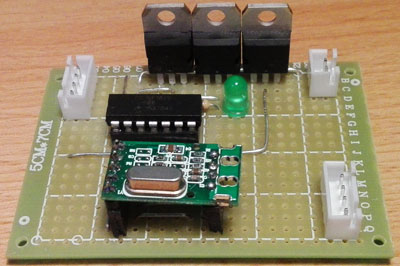

# Summary #
This repository contains code for a small project on a PIC-Microcontroller "PIC16F1825".
The aim of the project is to control a 12-V-LED-Strip via PWM. The values for red, green and blue are received via USART.
Many files are created from MCC itself. MCC is a small tool for MPLAB-X for code-generation.

# First try #
I first tried the IDE with an Arduino Uno. As you can see here: https://learn.adafruit.com/rgb-led-strips/usage 
. There is an example how to build it up. I nearly build it up the same using these transistors for PWM.

# Devices used #
- PIC16F1825
- 12-V-LED-Strip
- 12-V-Power-Supply
- USB-TTL-Transferor
- PICKIT 3 for programming

# Pins used on PIC16F1825 #
```
         ________
    5V -|1  °  14|- GND
       -|2     13|- TX
       -|3     12|- RX
       -|4     11|- CCP3
  CCP1 -|5     10|- Status-LED
       -|6      9|- CCP4
       -|7______8|-
```
As you can see there are three CCP-Pins for PWM and two pins for RX/TX each.
If

# USART-Command-String #
One command string is build this way: ``(r,g,b)`` whereas ``(`` is ASCII-Sign 0x28,  ``)`` is 0x29, ``,`` is 0x2C. r, g, b are each decimal digits from 0 to 255 each fitting in one byte of data.

# IDE and compiling #
I used the IDE MPLAB-X and compiled with XC8 (v1.35). You can download the compiler from the Microchip-Homepage and select it after the installation in the IDE.
As the programmer I used PICkit 3.

# Example-Program #
In order to test it without typing one (r,g,b)-String each time or programming a simple loop, I copied a JAVA-Project from a color-chooser and each time another color was chosen, I sent the new RGB-String. See my other projects therefor.
See [Serial Color Chooser](https://bitbucket.org/arnegue/serial-color-chooser) (Java) or bigger [Audio-CPU-RGB](https://bitbucket.org/arnegue/audio-cpu-rgb) (C#) for more details!

# Future programs #
My primary aim for controlling this RGB-LED-Strip is, to change the color depending on the CPU-Temperature. This will be programmed later. Also another IDE was to control them depending on the music/beats running.

#  Example #
An example for how both programs interact can be found on [Youtube](https://youtu.be/dFWHwqLQKIw).


# Circuit Board #
I made a small Circuit Board for the Microcontroller and the Transistors.:



## Pin-Out for Sockets ##

###USB Plug Socket###
```
 __________
|       |12|
|_______|34|

1  Black Gnd
2  Red	 5 Volt
3  Green D +
4  White D -
```
###Mini-DIN Plug Socket###
```
 _____
|  |12|
|__|34|

1 Yellow LED-Green
2 Black  12 Volt
3 Red	 LED-Red
4 White  LED-Blue
```
###Board Socket Power###
```
 ___
|  _|
|1|   
|2|_
|___|

1  12 V
2  Gnd
```
###Board Socket USB###
```
 ___
|  _|
|1|
|2|
|3|   
|4|_
|___|

1  Red	 5 Volt
2  White D -
3  Green D +
4  Black Gnd
```
###Board Socket LED###
```
 ___
|  _|
|1|
|2|
|3|   
|4|_
|___|

1  LED-Red
2  LED-Green
3  LED-Blue
4  12 Volt
```

